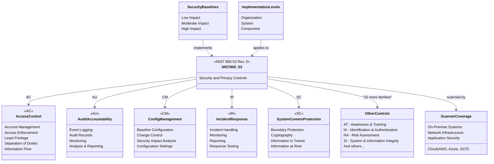

# NIST 800-53 Security Compliance Scanner

[](https://www.python.org/downloads/)
[](https://github.com/astral-sh/ruff)
[](http://mypy-lang.org/)
[](https://github.com/PyCQA/bandit)
[](https://opensource.org/licenses/MIT)

## Overview

This tool provides a **comprehensive security compliance scanning solution** based on NIST 800-53 Rev. 5 control requirements, updated to 2025 standards. It supports multiple cloud providers (AWS, Azure, GCP) and on-premise environments, offering in-depth security assessments across various control categories with modern Python 3.12+ features and best practices.

## NIST 800-53 Framework



## Features

### Core Capabilities

- **Multi-cloud and on-premise support** - AWS, Azure, GCP, and hybrid environments
- **Modular security control scanning** - Flexible architecture for custom controls
- **Detailed compliance reporting** - Multiple output formats (JSON, Markdown, HTML)
- **Real-time monitoring** - Continuous compliance tracking with Prometheus/Grafana
- **Modern Python 3.12+** - Type-safe, async-first, with latest security features

### NIST 800-53 Control Families

- **AC** - Access Control
- **AU** - Audit and Accountability
- **SC** - System and Communications Protection
- **CM** - Configuration Management
- **IR** - Incident Response
- **IA** - Identification and Authentication
- **RA** - Risk Assessment
- **SI** - System and Information Integrity

### 2025 Technology Stack

- **FastAPI** - Modern async web framework
- **Pydantic v2** - Advanced data validation
- **SQLAlchemy 2.0** - Modern ORM with async support
- **OpenTelemetry** - Distributed tracing and observability
- **Ruff** - Ultra-fast Python linting and formatting
- **Docker & Kubernetes** - Cloud-native deployment

## Prerequisites

- **Python 3.12+** (Latest Python for 2025 standards)
- Cloud provider credentials (as applicable)
- Network access to scanned environments
- Docker (optional, for containerized deployment)
- Git (for version control)

## Installation

### Using pip (recommended)

```bash
# Install with all dependencies
pip install -e ".[all]"

# Install for production use
pip install .

# Install for development
pip install -e ".[dev]"
```

### Using Docker

```bash
# Build and run with Docker Compose
docker-compose up -d

# Build standalone container
docker build -t nist-compliance-scanner .
```

### For Development

```bash
# Clone the repository
git clone https://github.com/your-org/nist-800-53-scanner.git
cd nist-800-53-scanner

# Create virtual environment (recommended)
python -m venv venv
source venv/bin/activate  # On Windows: venv\Scripts\activate

# Install with development dependencies
pip install -e ".[dev]"

# Install pre-commit hooks
pre-commit install
```

## Configuration

Edit the `config.yaml` file to configure:

- Cloud provider credentials
- On-premise environment details
- Scanning options
- Reporting preferences

### Example Configuration Sections

```yaml
# Cloud Provider Configuration
aws:
  enabled: true
  access_key: ${AWS_ACCESS_KEY}
  secret_key: ${AWS_SECRET_KEY}

# On-Premise Configuration
on_premise:
  linux:
    enabled: true
    hosts:
      - 192.168.1.100
    ssh_key_path: /path/to/ssh/key
```

## Usage

```bash
# Run a comprehensive scan
python scan.py --config config.yaml --environment cloud

# Generate a compliance report
python scan.py --config config.yaml --report markdown
```

## Scanning Categories

1. **Access Control**
   - IAM policy review
   - Account management checks
   - Privilege escalation prevention

2. **Audit Logging**
   - Cloud trail logging
   - System event monitoring
   - Log retention and analysis

3. **Network Security**
   - Firewall configuration
   - Network segmentation
   - Boundary protection

4. **Configuration Management**
   - System hardening
   - Configuration baseline
   - Change management

5. **Incident Response**
   - Incident detection mechanisms
   - Response plan evaluation
   - Training and preparedness

## Reporting

The scanner generates reports in:

- Markdown
- JSON
- Optional email notifications

## Observability (Grafana and Prometheus)

The Flask app in [`dashboard/`](dashboard/) exposes **Prometheus** metrics at **`GET /metrics`** (no authentication). The same aggregates are available as JSON on **`GET /api/v2/posture`** after login. Grafana is provisioned from this repository to visualize those series.

### Docker Compose

```bash
docker compose up -d
```

| Service                   | URL                                            | Notes                                                                                                                                                                                                                                                                            |
| ------------------------- | ---------------------------------------------- | -------------------------------------------------------------------------------------------------------------------------------------------------------------------------------------------------------------------------------------------------------------------------------- |
| Compliance dashboard (UI) | [http://localhost:8000](http://localhost:8000) | Web UI; `/dashboard` requires login. The stack sets `DASHBOARD_PORT=8000` so the container matches Prometheus scrape targets.                                                                                                                                                    |
| Prometheus                | [http://localhost:9090](http://localhost:9090) | Scrapes job `nist_dashboard` → `nist_compliance_scanner:8000/metrics`.                                                                                                                                                                                                           |
| Grafana                   | [http://localhost:3000](http://localhost:3000) | Default admin user `admin` / password `admin` (change `GF_SECURITY_ADMIN_PASSWORD` for any non-local use). Datasource and the **NIST dashboard overview** dashboard load from [`grafana/provisioning/`](grafana/provisioning/) and [`grafana/dashboards/`](grafana/dashboards/). |

### Exported metrics (prefix `nist_dashboard_`)

- `nist_dashboard_compliance_pct` — overall compliance percentage
- `nist_dashboard_controls_total`, `nist_dashboard_controls_compliant`, `nist_dashboard_controls_non_compliant`
- `nist_dashboard_poam_open`, `nist_dashboard_poam_critical_open`
- `nist_dashboard_family_compliance_pct{family="AC"}` (and other NIST families present in the latest report)
- `nist_dashboard_data_available` — `1` when decryptable scan results are loaded, `0` otherwise
- `nist_dashboard_latest_report_info` — info metric with `report_id` and `last_scan_date` labels

### Security note

Expose `/metrics` only on trusted networks (for example inside the Compose network). For production, terminate TLS on a reverse proxy, set a strong Grafana admin password, and restrict who can reach Prometheus and the scrape port.

### Local run without Docker

```bash
export DASHBOARD_PORT=8000   # optional; overrides YAML `app.port`
python dashboard/app.py
curl -s http://127.0.0.1:8000/metrics | head
```

## 🏛️ FedRAMP Alignment

**FedRAMP Moderate** for cloud services is aligned with the **NIST SP 800-53 Rev. 5 moderate baseline** as defined for **moderate-impact** systems (see NIST SP 800-53B for control baselines by impact level). Authorizations at the Moderate level expect that baseline to be implemented, assessed, and continuously monitored in line with FedRAMP requirements.

### FedRAMP Implementation Resources

This scanner provides **technical evidence collection** for FedRAMP assessments:

- 📋 [**docs/fedramp-baseline.md**](docs/fedramp-baseline.md) — FedRAMP Moderate baseline guide + step-by-step scanner usage
- 📊 [**docs/aws-config-mapping.md**](docs/aws-config-mapping.md) — 50+ AWS Config rules mapped to NIST 800-53 controls
- 📊 [**dashboard/README.md**](dashboard/README.md) — Grafana integration for continuous compliance monitoring
- 🔄 [**../cloud-security-best-practices/fedramp-30-days/**](../cloud-security-best-practices/fedramp-30-days/) — 30-day FedRAMP implementation roadmap

### Usage for FedRAMP Assessment

1. **Baseline Scan** — Run scanner against AWS environment (see [fedramp-baseline.md](docs/fedramp-baseline.md#step-2-run-baseline-scan))
2. **Evidence Collection** — Export compliance reports (HTML, JSON, NIST format)
3. **POA&M Tracking** — Track remediation of non-compliant controls
4. **3PAO Readiness** — Provide dashboard view for independent assessor
5. **Continuous Monitoring** — Use Grafana dashboard for post-ATO monitoring

**Disclaimer:** This repository is a **technical aid** for scanning, reporting, and dashboard-style visibility against NIST-style control themes. It does **not** by itself constitute FedRAMP authorization, a System Security Plan (SSP), control narratives, evidence for a 3PAO, or an official moderate baseline inheritance package. Use it alongside your governance program, assessors, and cloud provider shared responsibility documentation.

---

## AWS Config Rules and NIST Control Families

AWS Config managed rules and conformance packs (for example **Operational Best Practices for NIST SP 800-53 Rev. 5**) map individual rules to **specific NIST controls**. See [**docs/aws-config-mapping.md**](docs/aws-config-mapping.md) for a **comprehensive mapping of 50+ rules to NIST 800-53 controls** across all control families (AC, AU, CM, SC, etc.).

The table below is a **short, illustrative** mapping from representative rules to **NIST 800-53 control families** only. For authoritative rule-to-control mapping, use [AWS Config conformance packs](https://docs.aws.amazon.com/config/latest/developerguide/conformance-packs.html) and your SSP; validate every control in your environment.

| Representative AWS Config rule                     | NIST 800-53 family (illustrative)                  |
| -------------------------------------------------- | -------------------------------------------------- |
| CloudTrail enabled / multi-Region trail            | AU (Audit and Accountability)                      |
| S3 bucket public read/write prohibited             | AC, SC                                             |
| VPC flow logging enabled                           | AU, SC                                             |
| GuardDuty enabled                                  | IR, SI                                             |
| Security Hub enabled                               | SI, PM (program management / governance alignment) |
| EBS encryption by default                          | SC                                                 |
| RDS storage encrypted                              | SC                                                 |
| IAM root user MFA enabled                          | IA, AC                                             |
| IAM user MFA enabled for console users             | IA, AC                                             |
| IAM password policy (length, complexity, rotation) | IA                                                 |
| No root user access key                            | IA, AC                                             |
| Restricted common ports on security groups         | SC                                                 |
| Default security group no permissive rules         | AC, SC                                             |
| ALB / ELB TLS listener policy                      | SC                                                 |
| KMS key rotation enabled                           | SC                                                 |

## Security and Compliance

- Follows NIST 800-53 Rev. 5 guidelines
- Supports comprehensive and targeted scanning
- Provides actionable remediation guidance

## Contributing

1. Fork the repository
2. Create a feature branch
3. Commit your changes
4. Push to the branch
5. Create a Pull Request

## License

MIT License

## Disclaimer

This tool provides guidance and should be used as part of a comprehensive security strategy. Always consult security professionals for critical infrastructure.
